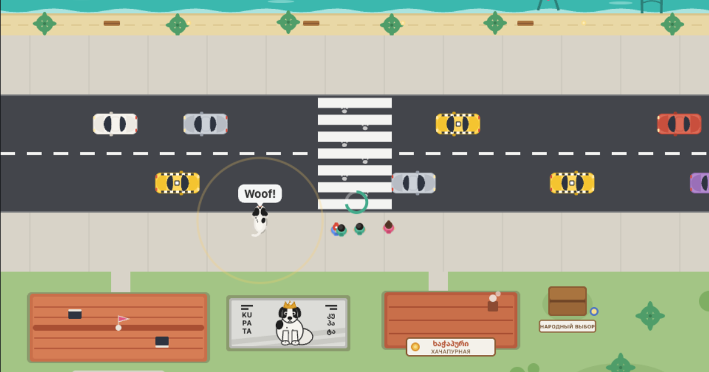

# Kupata — Hero of Batumi 🐾

**Play: [qupata.ge](https://qupata.ge)** — free, in the browser, no install. Works on phones.



Bark cars to a stop so the kindergarten kids can cross the road. Barking drains
energy — khachapuri from friendly locals restores it, but don't overeat. Never
bark at the ambulance: the kids will let it pass on their own.

## The real Kupata

Kupata was a real dog who lived by the Batumi seaside boulevard in Georgia.
Every day he ran out to the pedestrian crossing, barked at cars and walked
kids across the road — a true crossing guard. After a video of him went viral
in 2020 he became a symbol of the city: Batumi gave him a personal doghouse
with a "People's Choice" plaque, and a mural with his portrait appeared on a
nearby wall. There is even [an animated short about him](https://www.youtube.com/watch?v=PUNFDhJsbKw).

*In loving memory of Kupata (2014–2023).*

## Controls

- **Move** — arrows / WASD, or the virtual joystick on touch screens
- **Bark** — Space, or the WOOF! button
- **Pause** — P or Esc · **Mute** — M

Three languages: ქართული, русский, English.

## Running locally

ES modules don't work over `file://`, so serve the folder:

```sh
python3 serve.py
# open http://localhost:8000
```

`serve.py` is a plain `http.server` that adds `Cache-Control: no-store`, so the
browser never mixes stale and fresh modules after an edit.

## Tech

Vanilla JavaScript (ES modules), Canvas 2D, hand-made SVG sprites and WebAudio
sound — no dependencies, no build step. All game balance lives in
[`src/config.js`](src/config.js). Deploy is a push to GitHub Pages.

## Contributing

Issues and pull requests are welcome — especially corrections to the Georgian
texts from native speakers.
